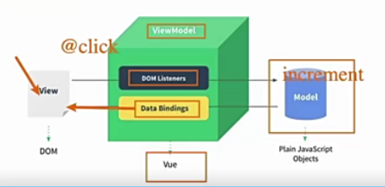
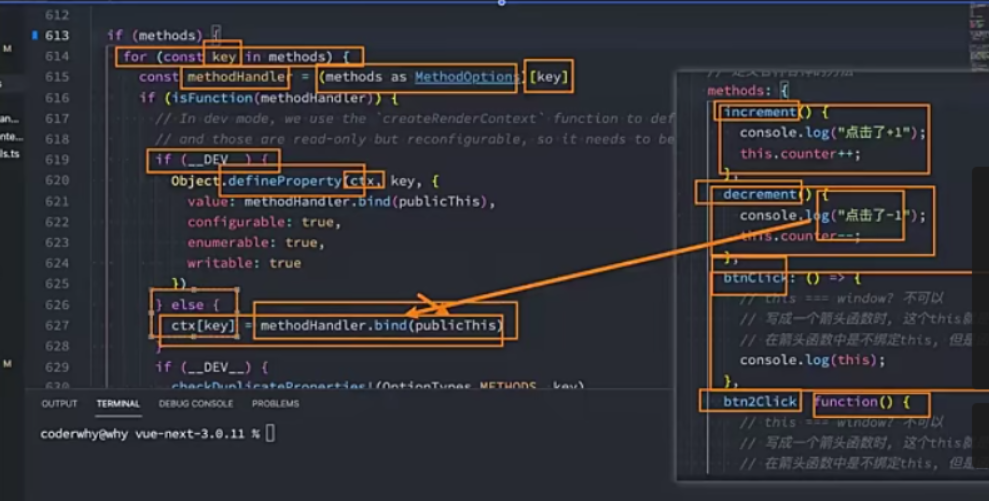

如何使用Vue呢？
- Vue的本质，就是一个JavaScript的库:
  刚开始我们不需要把它想象的非常复杂；
  我们就把他理解成一个已经帮助我们封装好的库；
  在项目中可以引入并且使用它即可。
  
- 安装使用Vue这个JavaScript库有哪些方式呢?
  1.在页面中通过CDN的方式来引入；
  
  - 通过相互连接的网络系统，利用最靠近每个用户的服务器；
    更快、更可靠地将音乐、图片、视频、应用程序及其他文件发送给用户
    来提供高性能、可拓展及低成本的网络内容传递给用户；
  
  - 常见的CDN服务器分为两种
    自己的CDN服务器：需要购买自己的CDN服务器，目前阿里，腾讯都可以购买CDN服务器
    开源的CDN服务器:国际上使用比较多的unpkg、JSDelivr,cdnjs;
  
  - ```javascript
    <script src="https://unpkg.com/vue@next"></script>
    ```
  
  2.下载Vue的JavaScript文件，并且自己手动引入；
  3.通过npm包管理工具安装使用它(webpack再讲)
  4.直接通过Vue CLI创建项目，并且使用它；

计数器案例
  - 如果我们希望实现一个计数器案例:
    点击+1，那么内容会显示数字+1;
    点击-1，那么内容会显示数字-1；
  - 对比原生和Vue的实现方式的不同
  - 命令式编程(how to do)和声明式(what to do)
  - 原生实现，每完成一个操作，需要通过JavaScript编写一条代码，来给浏览器一个指令；
    这样的编写代码过程中，为命令式编程；
  - Vue会在createApp传入的对象中声明需要的内容，模板template、数据data、方法methods
    为声明式编程；
  - MVVM和MVC一种软件体系结构
    MVC(Model-View-Control)、MVVM(Model-View-ViewModel)
    Vue官方其实有说明，Vue虽然并没有完全遵循MVVM模型，但整个设计是受它启发的，
    所以也称Vue是一个MVVM框架。
  - 

template属性
- 在使用createApp时，传入一个对象
- template属性：表示是Vue需要帮助我们渲染的模板信息
   目前我们看到它里面有很多的HTML标签，这些标签会替换掉我们挂载到的元素(比如id为app的div)的innerHTML;
   模板中有一些奇怪的语法，比如{{}}、@click这些都是模板特有的语法
   但是这个模板写法有点过于别扭了，并且IDE很有可能没有任何提示，阻碍编程效率；
- Vue提供了两种方式:
  1.使用script标签，并且标记它的类型为x-template;
    这个时候在createApp的对象中，我们需要传入的template以#开头；
    如果字符串以#开头，那么它将用作querySelector,并且使用匹配元素的innerHTML作为模板字符串；

  2.使用任意标签(通常使用template标签，因为不会被浏览器渲染)，设置id;
    template元素是一种用于保存客户端内容的机制，该内容再加载页面时不会被呈现，但随后可以在运行时使用Javascript实例化；

data属性
- data属性是传入一个函数，并且该函数需要返回一个对象；
   Vue2时，也可以传入一个对象(虽然官方推荐是一个函数)
   Vue3时，比如传入一个函数，否则就会直接在浏览器中报错；

- data中返回的对象会被Vue的响应式系统劫持，之后对该对象的修改或者访问都会在劫持中被处理；
  所以我们在template中通过{{counter}}访问counter,可以从对象中获取到数据；
  所以我们修改counter的值时，template中的{{counter}}也会发生改变；

methods属性
- methods属性是一个对象，通常我们会在这个对象中定义很多的方法:
   这些方法可以被绑定到template模板中；
   在该方法中，我们可以使用this关键字来直接访问到data中返回的对象的属性；

   官方文档：
    注意:不应该使用箭头函数来定义method函数(例如plus:()=>this.a++).
         理由是箭头函数绑定了父级作用域的上下文，所以this将不会按照期望指向组件实例，this.a将是undefined;
   q1:为什么不能使用箭头函数？
      1.在methods中使用data返回对象中的数据：
        那么这个this是必须有值的，并且应该可以通过this获取到data返回对象中的数据
      2.this不可以是window,因为window无法获取到data返回对象中的数据；
        但是如果我们使用箭头函数，this就指向window了
      3.为什么是window,涉及箭头函数this的查找规则，它会在自己的上层作用域中查找this;
        最终找到的是script作用域中的this，所以是window;
      4.this查找与绑定
      https://mp.weixin.qq.com/s/hYm0JgBI25grNG_2sCRlTA

   q2:不使用箭头函数的情况下，this到底指向的是什么? (bind(Proxy))
     事实上Vue的源码当中就是对methods中的所有函数进行了遍历，并且通过bind绑定了this;
   
   const publicThis = instance.proxy代理对象

其他属性
- 还可以定义其他属性
  比如props、computed、watch、emits、setup等等；
  也包括很多的生命周期函数；

Vue的源码
- 学习Vue的源码，比如看createApp实现过程
 1.在Github搜索vue-next.下载源代码git clone
 2.安装Vue源码项目相关的依赖
   yarn install'
 3.对项目执行打包操作
   执行yarn dev(执行前修改脚本)
   "dev":"node scripts/dev.js --sourcemap"
 4.通过packages/vue/dist/vue.global.js调试代码

 sourcemap 代码映射  把对应代码映射到具体打包文件里面
 比如runtime-dom/index.js
 把调试的源代码一一对应起来了
