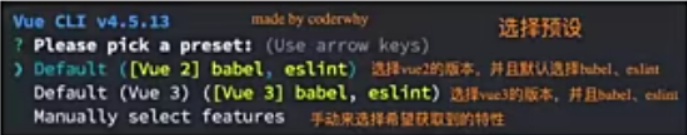
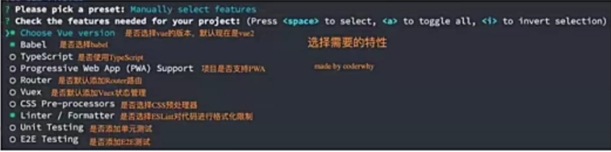
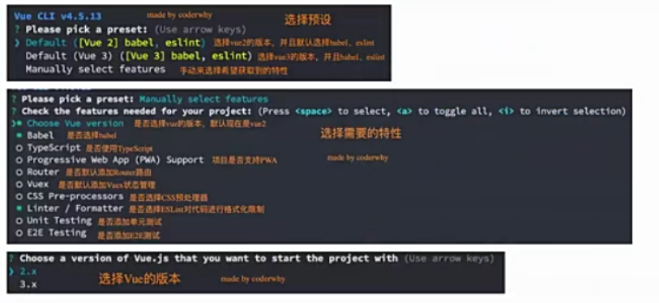
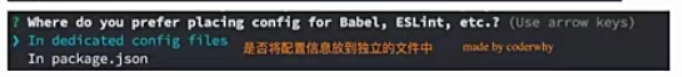
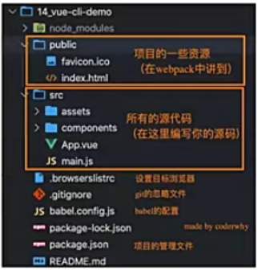
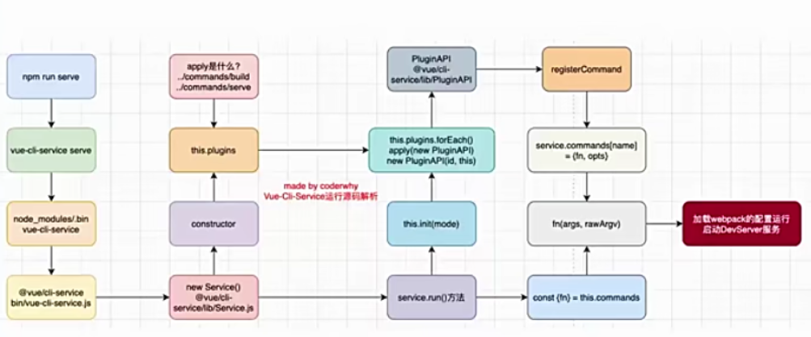
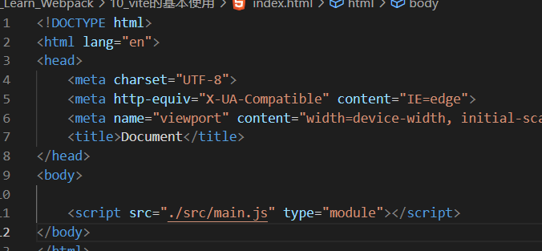
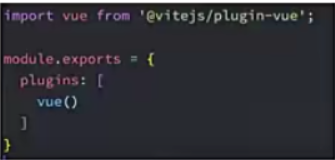
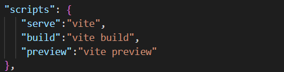
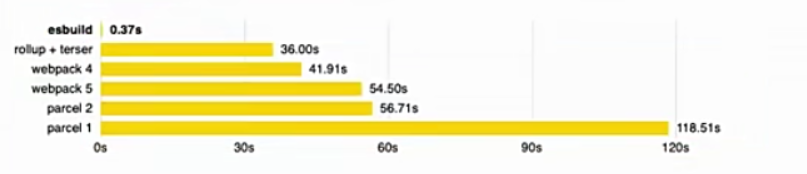

Vue CLI脚手架
- 什么是脚手架?
  我们前面学习了如何通过webpack配置Vue的开发环境，但是在真实开发中我们不可能每一个项目从头来完成所有的webpack配置，这样显示开发的效率会大大的降低；
  所以在真实开发中，我们通常会使用脚手架来创建一个项目，Vue的项目我们使用的就是Vue的脚手架；
  脚手架其实是建筑工程中的一个概念，在我们软件工程中也会将一些帮助我们搭建项目的工具称之为脚手架；
- Vue的脚手架就是Vue CLI:
  CLI是Command-Line Interface,翻译为命令行界面；
  我们可以通过CLI选择项目的配置和创建出我们的项目；
  Vue CLI已经内置了webpack相关的配置，我们不需要从零来配置；

Vue CLI安装和使用
- 安装Vue CLI(目前最新的版本是v4.5.13)
   我们是进行全局安装，这样在任何时候都可以通过vue的命令来创建项目；
   npm install @vue/cli -g
- 升级Vue CLI:
   如果是比较旧的版本，可以通过下面的命令来升级
   npm update @vue/cli -g
- 通过Vue的命令来创建项目
   vue create 项目的名称

vue cretae 项目的过程

项目的目录结构

Vue CLI的运行原理

认识Vite
- Webpack是目前整个前端使用最多的构建工具，但是除了webpack之后也有了其他的一些构建工具:
    比如rollup、parcel、gulp、vite等等
- 什么是vite呢?官方的定位:下一代前端开发与构建工具；
- 如何定义下一代开发和构建工具呢?
   我们知道在实际开发中，我们编写的代码往往是不能被浏览器直接识别的，比如ES6、TypeScript\Vue文件等等
   所以我们必须通过构建工具来对代码进行转换、编译，类似的工具有webpack、rollup、parcel;
   但是随着项目越来越大，需要处理的JavaScript呈指数级别增长，模块越来越多；
   构建工具需要很长的时间才能开启服务器，HMR也需要几秒钟才能在浏览器反应出来；
   所以也有这样的说法:天下苦webpack久矣；
- vite是一种新型前端构建工具，能够显著提升前端开发体验；

vite的构造
- 它主要由两部分组成:
   一个开发服务器,它基于原生ES模块提供了丰富的内建功能，HMR的速度非常速度；
   一套构建指令，它使用rollup打开我们的代码，并且它是预配置的，可以输出生成环境的优化过的静态资源。
- 目前是否大力学习vite?vite的未来是怎么样的?
   我个人非常看好vite的未来，也希望它可以有更好的发展；
   但是，目前vite虽然已经更新到2.0，依然并不算非常的稳定，并且比较少大型项目(或框架)
   使用vite进行搭建；
   vite的整个社区插件等支持也还不够完善；
   包括vue脚手架本身，目前也还没有打算迁移到vite，而依然使用webpack(虽然后期一定是有这个打算的)
   所以vite看起来非常的火热，在面试也可能会问到，但是实际项目中应用的还比较少；

浏览器原生支持模块化
- 
- 但是如果我们不借助于其他工具，直接使用ES Module来开发有什么问题呢?
   首先，我们会发现在使用lodash时，加载了上百个模块的js代码，对于浏览器发送请求是巨大的消耗；
   其次，我们的代码中如果有TypeScript、less、vue等代码时，浏览器并不能直接识别;
- 事实上，vite就帮助我们解决了上面的所有问题；

Vite的安装和使用
- 注意:Vite本身也是依赖Node的，所以也需要安装好Node环境
     并且Vite要求Node版本是大于12版本的；
- 首先，我们安装一下vite工具:
   npm install vite -g  全局安装
   npm install vite -D  局部安装
   npx vite 搭建本地服务

Vite对css的支持
- vite可以直接支持css的出路
   直接导入css即可
- vite可以直接支持css预处理器，比如less
   直接导入less;
   之后安装less编译器:
   npm install less -D
- vite直接支持postcss的转换:
   只需要安装postcss,并且配置postcss.config.js的配置文件即可；
   npm install postcss -D
   npm install postcss-preset-env -D 插件

Vite对TypeScript的支持

- vite对TypeScript是原生支持的，它会直接使用ESBuild来完成编译:
    只需要直接导入即可；
- 如果我们查看浏览器中的请求，会发现请求的依然是ts的代码:
     这是因为vite中的服务器Connect会对我们的请求进行转发；
     获取ts编译后的代码，给浏览器返回，浏览器可以直接进行解析；
- 注意:在vite2中，已经不再使用koa了，而是使用Connect来搭建的服务器
     由于大多数逻辑应该通过插件钩子而不是中间件来完成，因此对中间件的需求大大减少，内部服务器应用现在是一个很好的旧版的connect实例，而不是koa.

vite会建立一个本地的服务器koa(vite1)、Connect(vite2),
浏览器向服务器请求时请求的就是mul.ts(包括title.less文件),
vite把我们这里原来自己编写的代码(mul.ts,title.less)做了一个转换，
生成一个新的文件(名字mul.ts,title.less)-->但是发现这里面代码都是es6以上js代码，
浏览器真正去请求这个资源的时候，对这个请求做了一个拦截，
拦截之后对这个请求做了一个转发，这也是为什么用connect的原因，
因为connect非常容易做请求转发的
转发到转换后的mul.ts,真正给浏览器的是转换后的mul.ts这个代码，
这个代码给到浏览器都是es6的js代码，浏览器可以执行，

Vite对vue的支持
- vite对vue提供第一优先级支持:
   Vue3单文件组件支持:@vitejs/plugin-vue
   Vue3 JSX 支持: @vitejs/plugin-vue-jsx
   Vue2 支持: underfin/vite-plugin-vue2
- 安装支持vue的插件:
  npm install @vitejs/plugin-vue -D
- 在vite.config.js中配置插件:
   
配置vite  vite.config.js
npx vite

预打包

Vite打包项目
- 我们可以直接通过vite build来完成对当前项目的打包工具:
   npx vite build
- 我们可以通过preview的方式，开启一个本地服务来预览打包后的效果:
   npx vite preview  

npx不太友好 配置一下

ESBuild解析
- ESBuild解析
   超快的构建速度，并且不需要缓存；
   支持ES6和CommonJS的模块化；
   支持ES6的Tree Shaking;  把无用代码删除掉
   支持Go、JavaScript的API；
   支持TypeScript、JSX等语法编译;
   支持SourceMap;
   支持代码压缩;
   支持拓展其他插件;

ESBuild构建速度
- ESBuild的构建速度和其他构建速度的对比:
  
- ESBuild为什么这么快呢?
   使用Go语言编写的，可以直接转换成机器代码，而无需经过字节码；
   ESBuild可以充分利用CPU的多内核，尽可能让他们饱和运行；
   ESBuild的所有内容都是从零开始编写的，而不是使用第三方，所以从一开始就可以考虑各种性能问题；

Vite脚手架工具
- 在开发中，我们不可能所有的项目都使用vite从零去搭建，比如一个react项目、Vue项目；
   这个时候vite还给我们提供了对应的脚手架工具；
- 所以Vite实际上是有两个工具的:
   vite:相当于是一个构建工具，类似于webpack、rollup;
   @vitejs/create-app:类似vue-cli、create-raect-app;
- 如何使用脚手架工具呢?
  npm init @vitejs/app  
- 上面做法相当于省略了安装脚手架的过程:
  npm install @vitejs/create-app -g
  create-app 项目名字
  
