非父子组件的通信
- 在开发中，我们构建了组件树之后，除了父子组件之间的通信之外，还会有非父子组件之间的通信；
- 这里我们主要将两种方式:
   Provide/Inject;
   Mitt全局事件总线；

Provide和Inject
- Provide和Inject用于非父子组件之间共享数据:
    比如有一些深度嵌套的组件，子组件想要获取父组件的部分内容；
    在这种情况下，如果我们仍然将props沿着组件链逐级传递下去，就会非常的麻烦；
    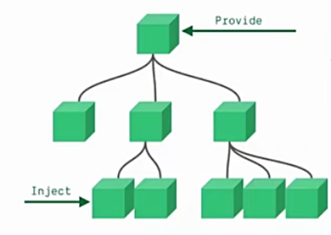
- 对于这种情况下，我们可以使用Provide和Inject：
   无论层级结构有多深，父组件都可以作为所有子组件的依赖提供者；
   父组件有一个provide选项来提供数据；
   子组件有一个inject选项来开始使用这些数据；
- 实际上，你可以将依赖注入看作是'long range props'，除了：
   父组件不需要知道哪些子组件使用它provide的property
   子组件不需要知道inject的property来自哪里；

Provide和Inject基本使用
- 我们开发一个这样的结构
  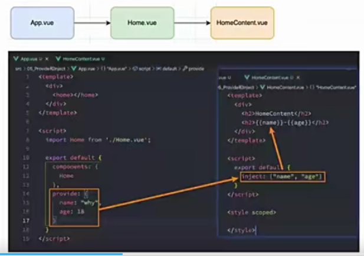

Provide和Inject函数的写法
- 如果Provide中提供的一些数据是来自data,那么我们可能会想要通过this来获取；
- 这个时候会报错:
  思考:我们的this使用的是哪里的this
  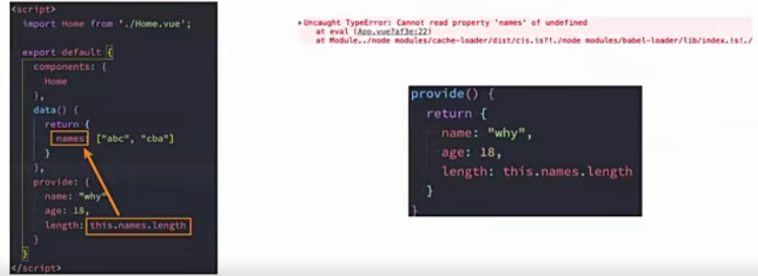

处理响应式数据
- 我们先来验证一个结果:如果我们修改了this.names的内容，那么使用length的子组件会不会是响应式的?
- 我们会发现对应的子组件中是没有反应的:
   这是因为当我们修改了names之后，之前在provide中引入的this.names.length本身并不是响应式的；
- 那么怎么样可以让我们的数据变成响应式的呢?
   非常的简单，我们可以使用响应式的一些API来完成这些功能，比如说computed函数；
   当然:这个computed是vue3的新特性，在后面我们会专门讲解，这里先直接使用一下;
- 注意:我们在使用length的时候需要获取其中的value
   这是因为computed返回的是一个ref对象，需要取出其中的value来使用；
   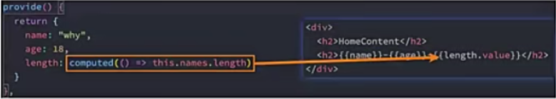

全局事件总线mitt库 eventBus
- Vue3从实例中移除了$on,$off和$once方法，所以我们如果希望继续使用全局事件总线，要通过第三方的库:
   Vue3官方有推荐的一些库，例如mitt或 tiny-emitter;
   这里我们讲解一下mitt库的使用；
- 首先，我们需要先安装这个库；
   npm install mitt
- 其次，我们可以封装一个工具eventbus.js
   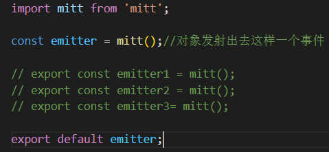

使用事件总线工具
- 我们在Home.vue中监听事件
- 我们在App.vue中触发事件
  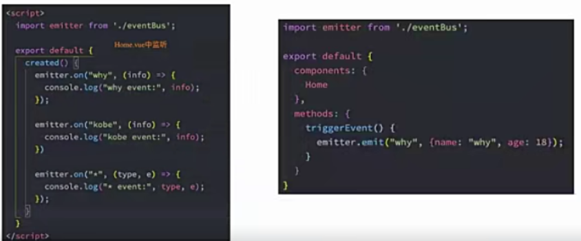

Mitt的事件取消
- 在某些情况下，我们可能希望取消掉之前注册的函数监听:
  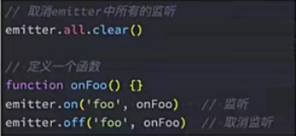

认识插槽Slot
- 在开发中,我们会经常封装一个个可复用的组件:
   前面我们会通过props传递给组件一些数据，让组件来进行展示；
   但是为了让这个组件具备更强的通用性，我们不能将组件中的内容限制为固定的div，span等等这些元素；
   比如某种情况下我们使用组件，希望组件显示的是一个按钮，某种情况下我们使用组件希望显示的是一张图片；
   我们应该让使用者可以决定某一块区域到底存放什么内容和元素；
- 举个例子:假如我们定制一个通用的导航组件--NavBar
   这个组件分为三块区域:左边-中间-右边,每块区域的内容是不固定；
   左边区域可能显示一个菜单图标，也可能显示一个返回按钮，可能什么都不显示；
   中间区域可能显示一个搜索框，也可能是一个列表，也可能是一个标题，等等；
   右边可能是一个文字，也可能是一个图标，也可能什么都不显示；
   

如何使用插槽slot
- 这个时候我们就可以来定义插槽slot：
   插槽的使用过程其实是抽取共性，预留不同；
   我们会将共同的元素、内容依然在组件内进行封装；
   同时会将不同的元素使用slotzuowei占位，让外部决定到底显示什么样的元素；
- 如何使用slot呢?
   Vue中将<slot>元素作为承载分发内容的出口；
   在封装组件中,使用特殊的元素<slot>就可以为封装组件开启一个插槽；
   该插槽插入什么内容取决于父组件如何使用;

插槽的基本使用
- 我们的一个组件MySlotCpn.vue：该组件中有一个插槽，我们可以在插槽中放入需要显示的内容；
- 我们在App.vue中使用他们：我们可以插入普通的内容、html元素、组件元素，都是可以的；

插槽的默认内容
- 有时候我们希望在使用插槽时，如果没有插入对应的内容，那么我们需要显示一个默认的内容；
    当然这个默认的内容只会在没有提供插入的内容时，才会显示；
    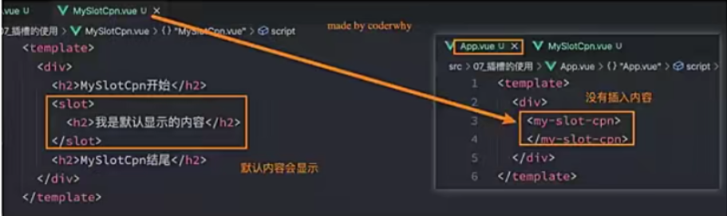

多个插槽的效果
- 我们先测试一个知识点:如果一个组件中含有多个插槽，我们插入多个内容时是什么效果?
   我们会发现默认情况下每个插槽都会获取到我们插入的内容来显示；
   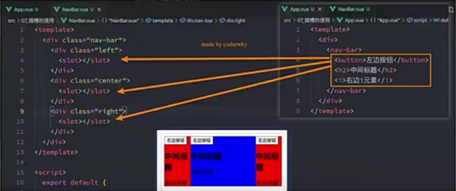

具名插槽的使用
- 事实上，我们希望达到的效果是插槽对应的显示，这个时候我们就可以使用具名插槽:
   具名插槽顾名思义就是给插槽起一个名字，<slot>元素有一个特殊的attribute:name;
   一个不带name的slot,会带有隐含的名字default
   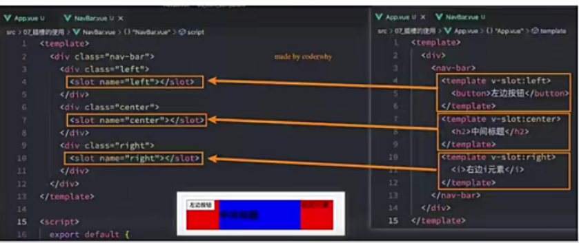

动态插槽名
- 什么是动态插槽名呢?
   目前我们使用的插槽名称都是固定的；
   比如v-slot:left、v-slot:center等等；
   我们可以通过v-slot:[dynamicSlotName]方式动态绑定一个名称
   

具名插槽使用的时候缩写
- 具名插槽使用的时候缩写
   跟v-on和v-bind一样，v-slot也有缩写；
   即把参数之前的所有内容(v-slot:替换为字符#)

渲染作用域
- 在vue中有渲染作用域的概念:
   父级模板里的所有内容都是在父级作用域中编译的；
   子模板里的所有内容都是在子作用域中编译的；
   
- 如何理解这句话呢?来看一个案例：
   在我们的案例中ChildCpn自然是可以让访问自己作用域中的title内容的；
   但是在App中，是访问不了ChildCpn中的内容的，因为它们是跨作用域的访问；
   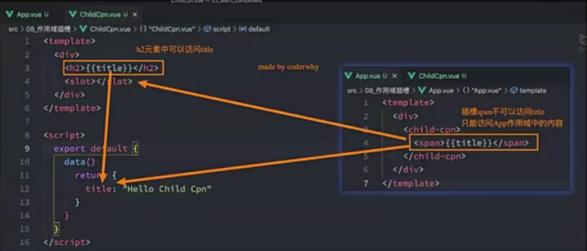

认识作用域插槽(开发中用的比较多)
- 但是有时候我们希望插槽可以访问到子组件中的内容是非常重要的:
   当一个组件被用来渲染一个数组元素时,我们使用插槽，并且希望插槽中没有显示每项的内容；
   这个Vue给我们提供了作用域插槽；
- 我们来看下面一个案例:
   1.在App.vue中定义好数据
   2.传递给ShowNames组件中
   3.ShowNames组件中遍历names数据
   4.定义插槽的prop
   5.通过v-slot:default的方式获取到slot的props
   6.使用slotProps中的item和index

作用域插槽案例

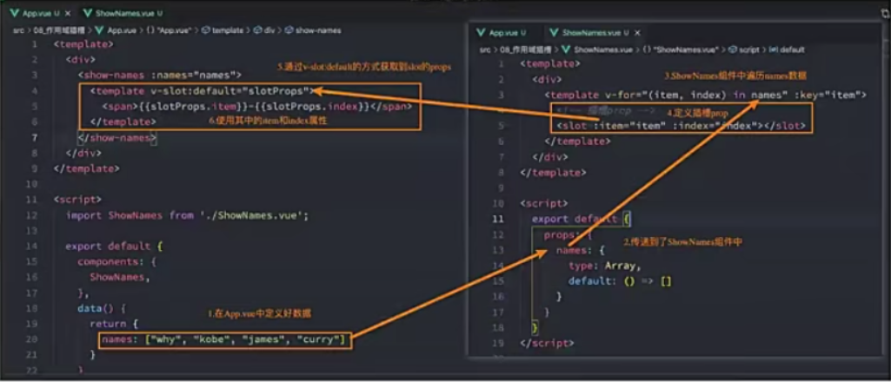

独占默认插槽的缩写

- 如果我们的插槽时默认插槽default,那么在使用的时候v-slot:default="slotProps"可以简写为v-slot="slotProps":

  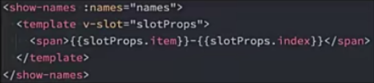

- 并且如果我们的插槽只有默认插槽时，组件的标签可以被当做插槽的模板来使用，这样，我们就可以将v-slot直接用在组件上:

  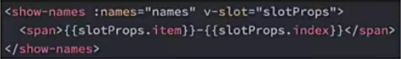

默认插槽和具名插槽混合

- 但是，如果我们有默认插槽和具名插槽，那么按照完整的template来编写。

  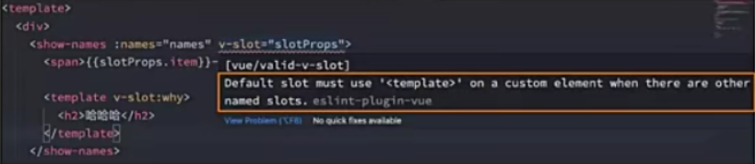

- 只要出现多个插槽,请始终为所有的插槽使用完整的基于<template>的语法:

  