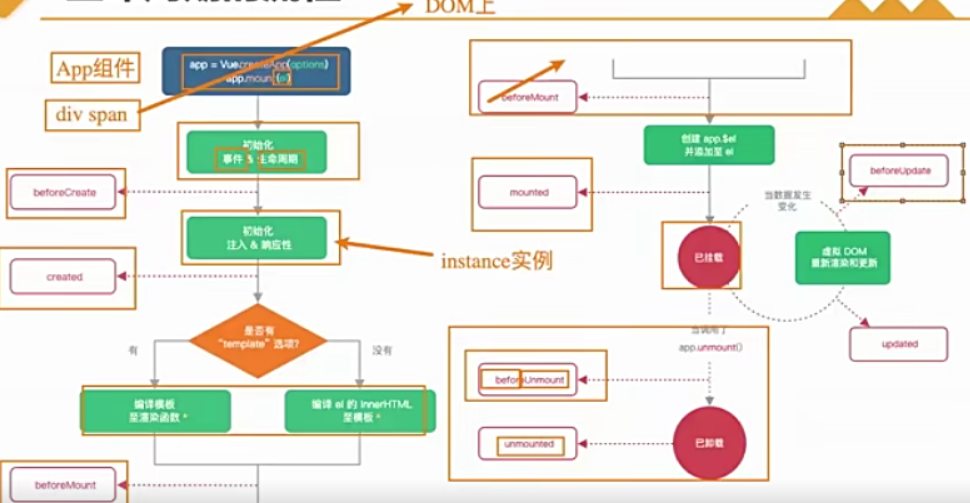

切换组件案例
- 比如我们现在想要实现一个功能:
   点击一个tab bar,切换不同的组件显示；
   
- 这个案例我们可以通过两种不同的实现思路来实现;
   1.通过v-if来判断，显示不同的组件；
   2.动态组件的方式；

v-if显示不同的组件
- 我们可以先通过v-if来判断显示不同的组件，这个可以使用我们之前讲过的知识来实现:
  

动态组件的实现
- 动态组件是使用component组件，通过一个特殊的attribute is实现：
  
- 这个currentTab的值需要是什么内容呢?
   可以通过component函数注册的组件
   在一个组件对象的components对象中注册的组件;

动态组件的传值
- 如果是动态组件我们可以给它们传值和监听事件吗?
     也是一样的；
     只是需要将属性和监听事件放到components上来使用；
    

认识keep-alive
- 我们先对之前的案例中About组件进行改造:
    在其中增加了一个按钮，点击可以递增的功能;
    
    
- 比如我们将counter点到10，那么在切换到home再切换回来about时，状态是否可以保持呢?
    答案是否定的；
    这是因为默认情况下，我们在切换组件后，about组件会被销毁掉，再次回来时会重新创建组件；
- 但是，在开发中某些情况下我们希望继续保持组件的状态，而不是销毁掉，这个时候我们就可以使用
   一个内置组件:keep-alive.
   

keep-alive属性
- keep-alive有一些属性:
   include -string|RegExp|Array.只有名称匹配的组件会被缓存；
   exclude -string|RegExp|Array.任何名称匹配的组件都不会被缓存；
   max -number|string.最多可以缓存多少组件实例，一旦达到这个数字，
       那么缓存组件中最近没有被访问的实例会被销毁；
- include和exclude prop允许组件有条件地缓存:
   二者都可以用逗号分隔字符串、正则表达式或一个数组来表示；
   匹配首先检查组件自身的name选项；
   

缓存组件的生命周期
- 对于缓存的组件来说，再次进入时，我们是不会执行created或者mounted等生命周期函数的；
    但是有时候我们确实希望监听到何时重新进入到了组件，何时离开了组件；
    这个时候我们可以使用activated和deactivated这两个生命周期钩子函数来监听；
    

Webpack的代码分包(后面会用路由来分包)
- 默认的打包过程:
   默认情况下，在构建整个组件树的过程中，因为组件和组件之间是通过模块化直接依赖的，
   那么webpack在打包时就会将组件模块打包到一起(比如一个app.js文件中)；
   这个时候随着项目的不断庞大，app.js文件的内容过大，会造成首屏的渲染速度变慢；
- 打包时，代码的分包:
   所以，对于一些不需要立即使用的组件，我们可以单独对它们进行拆分，拆分成一些小的代码块chunk.js;
   这些chunk.js会在需要时从服务器加载下来，并且运行代码，显示对应的内容；
- 那么webpack中如何可以对代码进行分包呢?
   

Vue中实现异步组件
- 如果我们的项目过大了,对于某些组件我们希望通过异步的方式来进行加载
  （目的是可以对其进行分包处理），那么Vue中给我们提供了一个函数：defineAsyncComponent.
- defineAsyncComponent接受两种类型的参数:
  类型一:工厂函数，该工厂函数需要返回一个Promise对象；
  类型二:接受一个对象类型,对异步函数进行配置；
- 工厂函数类型一的写法:
  
- 异步组件的写法二:
  

异步组件和Suspense(英文悬念意思)
- 注意:目前Suspense显示的是一个实验性的特性，API随时可能会修改。
- Suspense是一个内置的全局组件，该组件有两个插槽；
   default:如果default可以显示，那么显示default的内容；
   fallback:如果default无法显示,那么会显示fallback插槽的内容；
   

$refs的使用
- 在某些情况下，我们在组件中想要直接获取到元素对象或者子组件实例:
   在Vue开发中我们是不推荐进行DOM操作的；
   这个时候,我们可以给元素或者组件绑定一个ref的attribute属性；
- 组件实例有一个$refs属性:
   它有一个对象Object,持有注册过 ref attribute的所有DOM元素和组件实例。
   

$parent和$root
- 我们可以通过$parent来访问父元素。
- HelloWorld.vue的实现:
   这里我们也可以通过$root来实现，因为App是我们的根组件；
   
- 注意:在Vue3中已经移除了$children的属性,所以不可以使用了。

认识生命周期
- 什么是生命周期呢?
   每个组件都可能会经历从创建、挂载、更新、卸载等一系列的过程；
   在这个过程中的某一个阶段，用于可能会想要添加一些属于自己的代码逻辑
   (比如组件创建完后就请求一些服务器数据)；
   但是我们如何可以知道目前组件正在哪一个过程呢?Vue给我们提供了组件的生命周期函数；
   
- 生命周期函数:
   生命周期函数是一些钩子函数,在某个时间会被Vue源码内部进行回调；
   通过对生命周期函数的回调，我们可以知道目前组件正在经历什么阶段；
   那么我们就可以在该生命周期中编写属于自己的逻辑代码了;
   

组件的v-model

