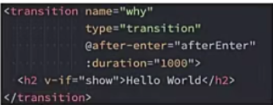
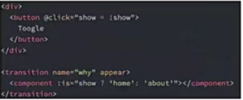
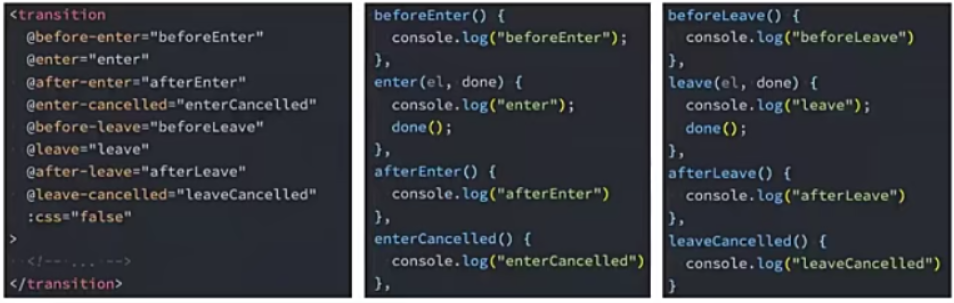

认识动画
- 在开发中,我们想要给一个组件的显示和消失添加某种过渡动画,可以很好地增加用户体验:
  React框架本身并没有提供任何动画相关的API，所以在React中使用过渡动画我们需要使用一个第三方库raect-transsition-group;
  Vue中为我们提供了一些内置组件和对应的API来完成动画，利用他们我们可以方便的实现过渡动画效果；
- 我们来看一个案例:
   Hello World的显示和隐藏；
   通过下面的代码实现，是不会有任何动画效果的；
- 没有动画的情况下,整个内容的显示和隐藏会非常的生硬:
   如果我们希望给单元素或者组件实现过渡动画，可以使用transition内置组件来完成动画；

Vue的transition动画
- Vue提供了transition的封装组件，在下列情形下，可以给任何元素和组件添加进入/离开过渡；
   条件渲染(使用v-if) 条件展示(v-show)
   动态组件
   组件根节点
   

Transition组件的原理
- 我们会发现,Vue自动给h2元素添加了动画,这是什么原因呢?
- 当插入或删除包含在transition组件中的元素时,Vue将会做以下处理:
   1.自动嗅探目标元素是否应用了CSS过渡或者动画，如果有,那么在恰当的时机添加/删除CSS类名；
   2.如果transition组件提供了JavaScript钩子函数,这些钩子函数将在恰当的时机被调用；
   3.如果没有找到JavaScript钩子并且也没有检测到CSS过渡/动画，DOM插入、删除操作将会立即执行；

过渡动画class
- 我们发现上面提到了很多个class,事实上Vue就是帮助我们在这些class之间来回切换完成的动画:
  v-enter-from:定义进入过渡的开始状态，在元素被插入之前生效，在元素被插入之后的下一帧移除；
  v-enter-active:定义进入过渡生效时的状态。在整个进入过渡的阶段中应用，在元素被插入之前生效，在过渡/动画完成之后移除。这个类可以被用来定义进入过渡的过程时间，延迟和曲线函数。
  v-enter-to:定义进入过渡的结束状态。在元素被插入之后下一帧生效(与此同时v-enter-from被移除),在过渡/动画完成之后移除。
  v-leave-from:定义离开过渡的开始状态。在离开过渡被触发时立刻生效，下一帧被移除。
  v-leave-active:定义离开过渡生效时的状态。在整个离开过渡的阶段中应用，在离开过渡被触发时立刻生效，在过渡/动画完成之后移除。这个类可以被用来定义离开过渡的过程时间，延迟和曲线函数。
  v-leave-to:离开过渡的结束状态。在离开过渡被触发之后下一帧生效(与此同时v-leave-from被删除)，在过渡/动画完成之后移除。

class添加的时机和命名规则

- class的name命名规则如下:
  如果我们使用的是一个没有name的transition,那么所有的class是以-作为默认前缀；
  如果我们添加了一个name属性,比如<transition name="why">,那么所有的class会以why-开头;

过渡css动画
- 前面我们是通过transition来实现的动画效果,另外我们也可以通过animation来实现。
  

同时设置过渡和动画
- Vue为了知道过渡的完成，内部是在监听transitionend或animationend,到底使用哪一个取决于元素应用的CSS规则:
   如果我们只是使用了其中的一个,那么Vue能自动识别类型并设置监听；
- 但是如果我们同时使用了过渡和动画呢?
   并且在这个情况下可能某一个动画执行结束时，另外一个动画还没有结束；
   在这种情况下,我们可以设置type属性为animation或者transition来明确的告知Vue监听的类型；

显示的指定动画时间
- 我们也可以显示的来指定过渡的时间,通过duration属性。
- duration可以设置两种类型的值:
   number类型:同时设置进入和离开的过渡时间；
   object类型:分别设置进入和离开的过渡时间；
   
   

过渡的模式mode
- 我们来看当前的动画在两个元素之间切换的时候存在的问题:
  
- 我们会发现Hello World和你好啊李银河是同时存在的:
  ​  这是因为默认情况下进入和离开动画是同时发生的；
  ​  如果确实我们希望达到这个的效果,那么是没有问题；

appear初次渲染
- 默认情况下,首次渲染的时候是没有动画的,如果我们希望给他添加上动画,那么就可以增加另外一个属性
  appear
  

认识animation.css动画库，
- 如果我们手动一个个来编写这些动画,那么效率是比较低的,所以在开发中我们可能会引用一些第三方库的,
    比如animation.css.
- 什么是animation.css呢?
   Animation.css是一个已经准备好的、跨平台的动画库为我们的web项目,对于强调、主、滑动、注意力引导非常有用；
- 如何使用Animation库呢?
   1.需要安装animate.css库
   2.导入animate.css库的样式；
   3.使用animation动画或者animate提供的类；

自定义过渡class
- 我们可以通过以下attribute来自定义过渡类名:
    enter-from-class
    enter-active-class
    enter-to-class
    leave-from-class
    leave-active-class
    leave-to-class
- 他们的优先级高于普通的类名,这对于Vue的过渡系统和其他第三方CSS动画库,
   如Animate.css。结合使用十分有用。

animate.css库的使用
- 安装animate.css：
  npm install animate.css
- 在main.js中导入animate.css
   import "animate.css"; 
- 接下来在使用的时候我们有两种用法:
   用法一:直接使用animate库中定义的keyframes动画;
   用法二:直接使用animate库提供给我们的类；
   

认识gsap库
- 某些情况下我们希望通过JavaScript来实现一些动画的效果，这个时候我们可以选择使用gsap库来完成。
- 什么是gsap呢?
   GSAP是The GreenSock Animation Platform(GreenSock动画平台)的缩写；
   它可以通过JavaScript为CSS属性，SVG,Canvas等设置动画,并且是浏览器兼容的；
- 这个库应该如何使用呢?
   1.需要安装gsap库
   2.导入gsap库
   3.使用对应的api即可；
- 我们可以先安装一下gsap库：
   npm install gsap

JavaScript钩子
- 在使用动画之前,我们先看一下transition组件给我们提供的JavaScript钩子,这些钩子可以帮助我们监听动画执行到什么阶段了。
  
- 当我们使用JavaScript来执行过渡动画时,需要进行done回调，否则它们将会被同步调用，过渡会立即完成。
- 添加:css="false",也会让Vue会跳过CSS的检测,除了性能略高之外,这可以避免过渡过程中CSS规则的影响。

gsap的使用
- 那么接下来我们就可以结合gsap库来完成动画效果:
  

gsap实现数字变化
- 在一些项目中,我们会见到数字快速变化的动画效果,这个动画可以很容易通过gsap来实现:
  

认识列表的过渡
- 目前为止,过渡动画我们只要是针对单个元素或者组件的:
    要么是单个节点；
    要么是同一时间渲染多个节点中的一个；
- 那么如果希望渲染的是一个列表,并且该列表中添加删除数据也希望有动画执行呢?
    这个时候我们要使用<transition-group>组件来完成；
- 使用<transition-group>有如下的特点:
   默认情况下,他不会渲染一个元素的包裹器,但是你可以指定一个元素并以tag attribute进行渲染；
   过渡模式不可用,因为我们不再相互切换特有的元素；
   内部元素总是需要特供唯一的key attribute值；
   css 过渡的类将会应用在内部的元素中,而不是这个组/容器本身；

列表过渡的基本使用
- 我们来做一个案例:
   案例是一列数字,可以继续添加或者删除数字；
   在添加和删除数字的过程中,对添加的或者移除的数字添加动画;
   

列表过渡的移动动画
- 在上面案例中虽然新增的或者删除的节点是有动画的,但是对于那些其他需要移动的节点是没有动画的;
  ​     我们可以通过使用一个新增的v-model的class来完成动画；
  ​     它会在元素改变位置的过程中应用；
  ​     像之前的名字一样,我们可以通过name来自定义前缀；
  

列表的交错过渡案例
- 我们来通过gsap的延迟delay属性,做一个交替消失的动画:
  