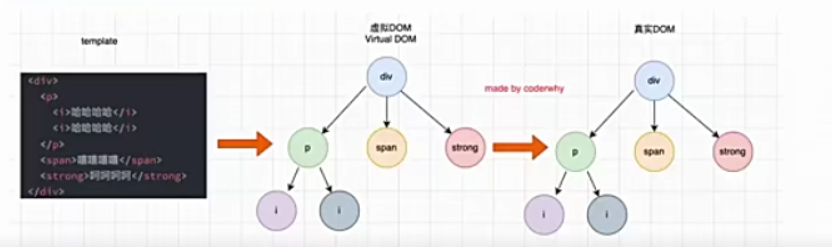
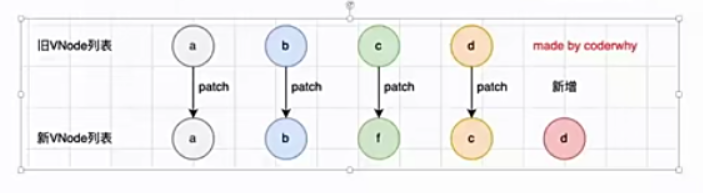
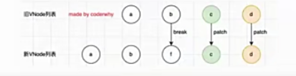
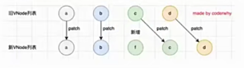
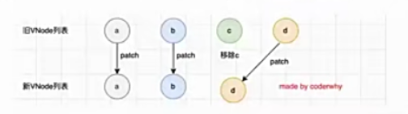
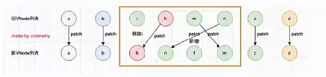

v-for列表渲染
- 真实开发中，我们往往会从服务器拿到一组数据，并且需要对其进行渲染。
  这个时候我们可以使用v-for来完成；
  v-for类似于javascript的for循环，可以用于遍历一组数据；

v-for基本使用
- v-for的基本格式是"item in 数组":
  数组通常是来自data或者prop,也可以是其他方式；
  item是我们给每项元素起的一个别名，这个别名可以自定义；
- 我们知道，在遍历一个数组的时候会经常需要拿到数组的索引:
   如果我们需要索引，可以使用格式:"(item,index) in 数组"；
   注意上面的顺序:数组元素项item是在前面的，索引项index是在后面的；
- v-for也支持遍历对象，并且支持有一二三个参数:
  一个参数:'value in object';
  二个参数:'(value,key) in object';
  三个参数:'(value,key,index) in object'

template元素
- 类似于v-if,你可以使用template元素来循环渲染一段包含多个元素的内容；
  我们使用template来对多个元素进行包裹，而不是使用div来完成；

数组更新检测
- Vue将被侦听的数组的变更方法进行了包裹，所以它们也将会触发视图更新。这些被包裹过的方法包括:
  push()
  pop()
  shift()
  unshift()
  splice()
  sort()
  reverse()
- 替换数组的方法
  上面的方法会直接修改原来的数组，但是某些方法不会替换原来的数组，而是会生成新的数组，比如filter()、concat()和slice();

v-for中的key的作用
- 在使用v-for进行列表渲染时，我们通常会给元素或者组件绑定一个key属性；
- 官方解释
  key属性主要用在Vue的虚拟DOM算法，在新旧nodes对比时辨识VNodes;
  如果不使用key,Vue会使用一种最大限度减少动态元素并且尽可能的尝试就地修改/复用相同类型元素的算法；
  而使用key时，它会基于key的变化重新排列元素顺序，并且会移除/销毁key不存在的元素；

认识VNode(最大好处：多平台适配跨平台)
- 因为目前我们还没有比较完整的学习组件的概念，所以目前先理解HTML元素创建出来的Vnode
- VNode的全称是Virtual Node,也就是虚拟节点；
- 事实上，无论是组件还是元素，他们最终在Vue中表达出来的都是一个个VNode;
- VNode的本质是一个JavaScript对象；

虚拟DOM
- 如果我们不只是一个简单的div,而是有一大堆的元素，那么它们应该会形成一个VNode Tree;

  

插入F的案例
- 在点击按钮时会在中间插入一个f
- 这次更新对于ul和button是不需要进行更新，需要更新的是我们li的列表:
  在Vue中，对于相同父元素的子元素节点并不会重新渲染整个列表；
  因为对于列表中a,b,c,d他们都是没有变化的；
  在操作真实DOM的时候，我们只需要在中间插入一个f的li即可；
- 那么Vue中对于列表的更新究竟是如何操作的呢?
  Vue事实上会对有key和没有key会调用两个不同的方法；
  有key,那么就使用patchKeyedChildren方法；
  没有key,那么就使用patchUnkeyedChildren方法；

Vue源码对于key的判断
- 没有key的过程
  我们会发现diff算法效率并不高:
  c和d来说它们事实上并不需要有任何的改动；
  但是因为我们的c被f所使用了，所以后续所有的内容都要进行一次改动，并且最后进行新增
  
  

- 有key的过程
  1.从头开始进行遍历，比较:
    a和b是一致的会继续进行比较；
    c和f因为key不一致，所以就会break跳出循环；
  
  
  
- 2.从尾部开始进行遍历，比较；

  

  3.如果旧节点遍历完毕，但是依然有新的节点，那么就新增节点；

  
  
  4.如果新的节点遍历完毕，但是依然有旧的节点，那么就移除旧节点；
  
  

  5.特殊的情况，中间还有很多未知的或者乱序的节点：(删除旧节点里没有的，挂载新节点新增的，patch其他的对应节点)

  
  
- 所以我们可以发现，Vue在进行diff算法的时候，会尽量利用我们的key来进行优化操作；
  在没有key的时候我们的效率是非常低效的；
  在进行插入或者重置顺序的时候，保持相同的key可以让diff算法更加的高效；