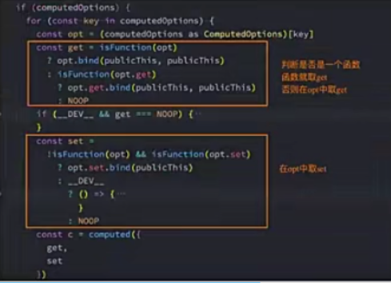
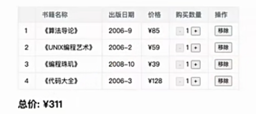

复杂data的处理方式
- 我们知道，在模板中可以直接通过插值语法显示一些data中的数据；
- 但是在某些情况下，我们可能需要对数据进行一些转化后再显示或者需要将多个数据结合起来进行显示；
  比如我们需要对多个data数据进行运算、三元运算符来决定结果、数据进行某种转化后显示；
  在模板中使用表达式，可以非常方便的实现，但是设计他们的初衷是用于简单的运算；
  在模板中放入太多的逻辑会让模板过重和难以维护；
  并且如果多个地方都使用到，那么会有大量重复的代码；
- 我们有没有什么方法可以将逻辑抽离出去呢?
  可以，其中一种方式就是将逻辑抽取到一个method中，放到methods的options中；
  但是，这种做法有一个直观的弊端，就是所有的data使用过程都会变成一个方法的调用；
  另外一种方式就是使用计算属性computed;

认识计算属性computed
- 什么是计算属性?
  官方:对于任何包含响应式数据的复杂逻辑，你都应该使用计算属性;
  计算属性将被混入到组件实例中，所有getter和setter的this上下文自动地绑定为组件实例；
- 计算属性的用法
  * 选项:computed
  * 类型:{[key:string]:Function | {get:Function,set:Function}}

案例实现思路
1.我们有两个变量:firstName和lastName,希望它们拼接之后在界面上显上；
2.我们有一个分数:score
  当score大于60的时候，在界面上显示及格；
  当score小于60的时候，在界面上显示不及格；
3.我们有一个变量message，记录一段文字：比如Hello World
  某些情况下我们是直接显示这段文字；
  某些情况下我们需要对这段文字进行反转；
我们可以有三种实现思路
  a.在模板语法中直接使用表达式；
    缺点一：模板中存在大量的复杂逻辑，不便于维护(模板中表达式的初衷是用于简单的计算)
    缺点二:当有多次一样的逻辑时，存在重复的代码；
    缺点三:多次使用的时候，很多运算也需要多次执行，没有缓存；
  b.使用method对逻辑进行抽取
    缺点一:我们事实上先显示的是一个结果，但是都变成了一种方法的调用；
    缺点二:多次使用方法的时候，没有缓存，也需要多次计算；
  c.使用计算属性computed;
    注意:计算属性看起来像是一个函数，但是我们在使用的时候不需要加(),这个后面将setter和getter时会讲到；
    我们会发现无论是直观上，还是效果上计算属性都是最好的选择；
    并且计算属性是有缓存的；

计算属性 vs methods
- 在上面的实现思路中，我们发现计算属性和methods的实现看起来是差别不大的，而且我们多次提到计算属性有缓存的；
计算属性的缓存
- 原因
  这是因为计算属性会基于他们的依赖关系进行缓存；
  在数据不发生变化时，计算属性是不需要重新计算的；
  但是如果依赖的数据发生变化，在使用时，计算属性依然会重新进行计算；

计算属性的setter和getter
- 计算属性大多数情况下，只需要一个getter方法即可，所以我们会将计算属性直接写成一个函数。

- 但是，如果我们确实想设置计算属性的值，可以设置一个setter的方法；
  源码对setter和getter的处理

- Vue内部是如何对我们传入的是一个getter,还是说是一个包含setter和getter的对象进行处理呢？
  事实上非常简单，Vue源码内部只是做了一个逻辑判断而已；
  
  
  

认识侦听器watch
- 什么是侦听器？
  开发中我们在data返回的对象中定义了数据，这个数据通过插值语法等方式绑定到template中；
  当数据变化时，template会自动进行更新来显示最新的数据；
  但是在某些情况下，我们希望在代码逻辑中监听某个数据的变化，这个时候就需要用侦听器watch来完成了。
- 侦听器的用法如下:
   选项:watch
   类型:{[key:string]:string | Function | Object | Array}

侦听器案例
- 比如现在我们希望用户在input中输入一个问题；
  每当用户输入了最新的内容，我们就获取到最新的内容，并且使用该问题去服务器查询答案；
  那么，我们就需要实时的获取最新的数据变化；

侦听器watch的配置选项
- 来看例子
  当我们点击按钮的时候会修改info.name的值；
  这个时候我们使用watch来侦听info,可以侦听到吗?不可以
- 因为默认情况下,watch只是在侦听info的引用变化，对于内部属性的变化是不会做出响应的；
  这个时候我们可以使用一个选项deep进行更深层的侦听；
  注意前面我们说过watch里面侦听的属性对应的也可以是一个Object;
- 另外一个属性，是希望一开始的就会立即执行一次；
  这个时候我们使用immediate选项
  这个时候无论后面数据是否有变化，侦听的函数都会有限执行一次；

侦听器watch的其他方式
- Vue3文档中没有提到的，但是Vue2文档中有提到的是侦听对象的属性；
  'info.name':function(newValue,oldValue){}
- 另外一种方式就是使用$watch的API
- 我们可以在created的生命周期中，使用this.$watchs来侦听；
  第一个参数是侦听的源；
  第二个参数是侦听的回调函数callback;
  第三个参数是额外的其他选项，比如deep、immediate;

综合案例-书籍购物车

1.在界面上以表格的形式，显示一些书籍的数据；
2.在底部显示书籍的总价格
3.点击+或者-可以增加或减少书籍数量(如果为1，那么不能继续)；
4.点击移除按钮，可以将书籍移除(当所有的书籍移除完毕后，显示:购物车为空~);

