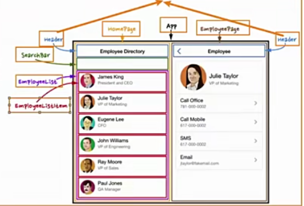

V-model的基本使用
- 表单提交是开发中非常常见的功能，也是和用户交互的重要手段:
  比如用户在登录、注册时需要提交账号密码；
  比如用户在检索、创建、更新信息时，需要提交一些数据；
- 这些都要求我们可以在代码逻辑中获取到用户提交的数据，我们通常会使用v-model指令来完成；
  v-model指令可以在表单input、textarea以及select元素上创建双向数据绑定；
  它会根据控件类型自动选取正确的方法来更新元素；
  尽管有些神奇，但v-model本质上不过是语法糖，它负责监听用户的输入事件来更新数据，
  并在某种极端场景下进行一些特殊处理；

v-model的原理
- 两个操作
  v-bind绑定value属性的值
  v-on绑定input事件监听到函数中，函数会获取最新的值赋值到绑定的属性中；

事实上v-model更加复杂

v-model绑定textarea
- 绑定其他的表单类型:textarea、checkbox、radio、select

v-model绑定checkbox
- 单个勾选框和多个勾选框
- 单个勾选框
  v-model即为布尔值；
  此时input的value并不影响v-model的值；
- 多个复选框
  当是多个复选框时，因为可以选中多个，所以对应的data中属性是一个数组；
  当选中某一个时，就会将input的value添加到数组中；

v-model绑定radio
- v-model绑定radio,用于选择其中一项；

v-model绑定select
- 和checkbox一样，select也分单选和多选两种情况；
- 单选:只能选中一个值
  v-model绑定的是一个值
  当我们选中option中的一个时，会将它对应的value赋值到fruit中；
- 多选:可以选中多个值
  v-model绑定的是一个数组；
  当选中多个值时，就会将选中的option对应的value添加到数组fruit中；

v-model的值绑定
- 目前我们在前面的案例中大部分的值都是在template中固定好的；
  比如gender的两个输入框值male、female;
  比如hobbies的三个输入框值basketball、football、tennis;
- 在真实开发中，我们的数据可能是来自服务器的，那么我们就可以先将值请求下来，绑定到data返回的对象中，
  再通过v-bind来进行值的绑定，这个过程就是值绑定。

v-model的修饰符-lazy
- 默认情况下，v-model在进行双向绑定时，绑定的是input事件，那么会在每次内容输入后就将最新的值和绑定的属性进行同步；
- 如果我们在v-model后跟上lazy修饰符，那么会将绑定的事件切换为change事件，只有在提交时(比如回车)才会触发；

v-model的修饰符-number
- 我们先来看一下v-model绑定后的值是什么类型的:
  message总是string类型，即使在我们设置type为number也是string类型；
- 如果我们希望转化为数字类型，那么可以使用.number修饰符；
- 另外，在我们进行逻辑判断时，如果是一个string类型，在可以转化的情况下会进行隐式转换的；

v-model的修饰符-trim
- 如果要自动过滤用户输入的守卫空白字符，可以给v-model添加trim修饰符;

v-model组件上使用
Vue2和Vue3有一些区别，后面组件化开发具体学习.

人处理问题的方式
- 人面对复杂问题的处理方式:
  任何一个人处理信息的逻辑能力都是有限的；
  所以，当面对一个非常复杂的问题时，我们不太可能一次性搞定一大堆的内容；
  但是，我们人有一种天生的能力，就是将问题进行拆解；
  如果将一个复杂的问题，拆分成很多个可以处理的小问题，再将其放在整体当中，你就会发现大的问题也会迎刃而解；

认识组件化开发
- 组件化也是类似的思想:
  * 如果我们将一个页面中所有的处理逻辑全部放在一起，处理起来就会变得非常复杂，而且不利于后续的管理以及拓展；
  
  * 但如果，我们将一个页面拆分成一个个小的功能块，每个功能块完成属于自己这部分独立的功能，
    那么之后整个页面的管理和维护就变得非常容易了；
    
  * 如果我们将一个个功能块拆分后，就可以像搭建积木一样来搭建我们的项目；
  
    

组件化开发
- 现在可以说整个大前端开发都是组件化的天下，无论从三大框架(Vue、React、Angular),还是跨平台方案的Flutter,
  甚至是移动端都在转向组件化开发，包括小程序的开发也是采用组件化开发的思想。
- 所以，学习组件化最重要的是它的思想，每个框架或者平台可能实现方法不同，但是思想都是一样的。
- 我们需要通过组件化的思想来思考整个应用程序:
  我们将一个完整的页面分成很多个组件；
  每个组件都用于实现页面的一个功能块；
  而每一个组件又可以进行细分；
  而组件本身又可以在多个地方进行复用；

Vue的组件化
- 组件化是Vue、React、Angular的核心思想，也是重点(包括以后实战项目):
  前面我们的createApp函数传入了一个对象App,这个对象其实本质上就是一个组件，也是我们应用程序的根组件
  组件化提供了一种抽象，让我们可以开发出一个个独立可复用的小组件来构造我们的应用；
  任何的应用都会被抽象成一颗组件树；
- 接下来学习在Vue中如何注册一个组件，以及如何使用这个注册后的组件。

注册组件的方式
- 如果我们现在有一部分内容(模板、逻辑等)，我们希望将这部分内容抽取到一个独立的组件中去维护，
  这个时候如何注册一个组件呢?
- 全局组件:在任何其他的组件中都可以使用的组件；
- 局部组件:只有在注册的组件中才能使用的组件；

注册全局组件
- 全局组件需要使用我们全局创建的app来注册组件；
- 通过component方法传入组件名称、组件对象即可注册一个全局组件了；
- 之后，我们可以在App组件的template中直接使用这个全局组件；

全局组件的逻辑
- 组件本身也可以有自己的代码逻辑
  比如自己的data、computed、methods等等；

组件的名称
- 在使用app.component注册一个组件的时候，第一个参数是组件的名称，定义组件名方式两种:
- 使用kebab-case(短横线分隔符)
  使用短横线分隔符定义组件，也必须在引用这个自定义元素时使用kebab-case;
- 使用PascalCase(驼峰标识符)

注册局部组件
- 全局组件往往是在应用程序一开始就会全局组件完成，那么就意味着如果某些组件我们并没有用到，
  也会一起被注册；
  * 比如我们注册了三个全局组件:ComponentA、ComponentB、ComponentC;
  * 在开发中我们只使用了ComponentA、ComponentB,如果ComponentC没有用到但是我们依然在全局进行了注  册，那么就意味着类似于webpack这种打包工具在打包我们的项目时，我们依然会对其打包；
  * 这样最终打包出的JavaScript包就会有关于ComponentC的内容，用户在下载对应的JavaScript也会增加包的大小。
- 所以在开发中我们通常使用组件的时候采用的都是局部注册:
  局部注册是在我们需要使用到的组件中，通过components属性选项来进行注册；
  比如之前的App组件中，我们有data、computed、methods等选项了，事实上还可以有一个components选项；
  该components选项对应的是一个对象，对象中的键值对是组件的名称:组件对象；

Vue的开发模式
- 目前我们使用vue的过程都是在html文件中，通过template编写自己的模板、脚本逻辑、样式等；
- 但是随着项目越来越复杂，我们会采用组件化的方式来进行开发:
   这就意味着每个组件都会有自己的模板、脚本逻辑、样式等；
   当然我们依然可以把他们抽离到 单独的js、css文件中，但是他们还是会分离开来；
   也包括我们的script是在一个全局作用域下，很容易出现命名冲突的问题；
   并且我们的代码为了适配一些浏览器，必须使用ES5的语法；
   在我们编写代码完成之后，依然需要通过工具对代码进行构建、代码；
- 在真实开发中，我们可以通过一个后缀名为.vue的single-file components(单文件组件)来解决，
  并且可以使用webpack或者vite或者rollup等构建工具来对其进行处理；

单文件的特点
- 在这个组件中我们可以获得非常多的特性:
  代码的高亮；
  ES6、CommonJS的模块化能力；
  组件作用域的CSS
  可以使用预处理器来构建更加丰富的组件，比如TypeScript、Babel、Less、Sass等；

如何支持SFC
- 如果我们想要使用这一的SFC的.vue文件，比较常见的是两种方式:
  1.使用Vue CLI来创建项目，项目会默认帮助我们配置好所有的配置选项；
  2.自己使用webpack或rollup或vite这类打包工具，对其进行打包处理；
- 我们最终，无论是后期做项目，还是公司进行开发，通常都会采用Vue CLI的方式完成;

