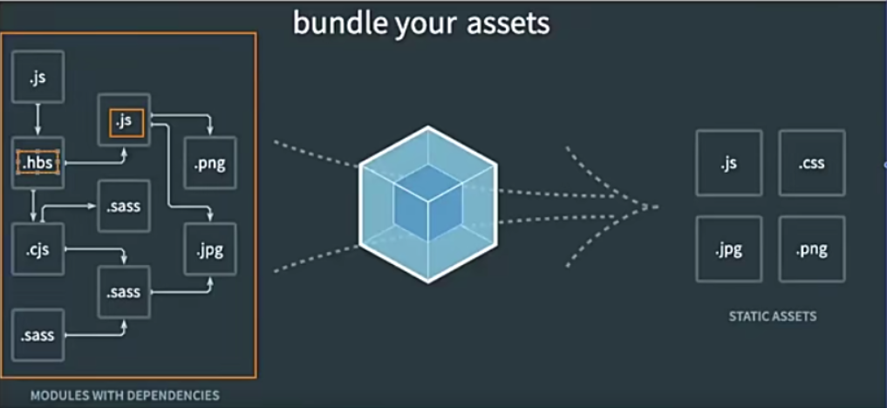
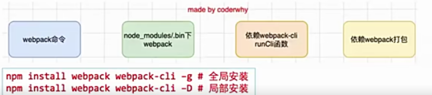
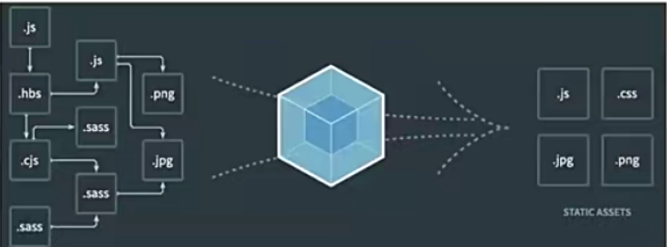

认识webpack
- 事实上随着前端的快速发展，目前前端的开发已经变得越来越复杂了:
  比如开发过程中我们需要通过模块化的方式来开发；
  比如也会使用一些高级的特性来加快我们的开发效率或者安全性，比如通过ES6+、
    TypeScript开发脚本逻辑，通过sass、less等方式来编写css样式代码；
  比如开发过程中，我们还希望实时的监听文件的变化并且来反映到浏览器上，提高开发的效率；
  比如开发完成后我们还需要将代码进行压缩、合并以及其他相关的优化；
  等等...
- 但是对于很多的前端开发者来说，并不需要思考这些问题，日常的开发中根本就没有面临这些问题:
   这是因为目前前端开发我们通常都会直接使用三大框架来开发:Vue、React、Angular;
   但是事实上，这三大框架的创建过程我们都是借助于脚手架(CLI)的；
   事实上Vue-CLI、create-react-app、Angular-CLI都是基于webpack来帮助我们支持模块化\
    less、TypeScript、打包优化等的;

脚手架依赖webpack
- 事实上我们上面提到的所有脚手架都是依赖于webpack的；

Webpack到底是什么呢?
- 官方解释:
  webpack is a static module bundler for modern JavaScript application;
- webpack是一个静态的模块化打包工具，为现代的JavaScript应用程序；
  打包bundler：webpack可以帮助我们进行打包，所以他是一个打包工具；
  静态的static：这样表述的原因是我们最终可以代码打包成最终的静态资源(部署到静态服务器)；
  模块化module：webpack默认支持各种模块化开发，ES Module、CommonJS、AMD等；
  现代的modern：我们前端说过，正是因为现代前端开发面临各种各样的问题，才催生了Webpack的出现和发展；

Webpack官方图片

Vue项目加载的文件有哪些呢?
- JavaScript的打包:
  将ES6转换成ES5的语法；
  TypeScript的处理，将其转换成JavaScript;
- Css的处理:
  CSS文件模块的加载、提取；
  Less、Sass等预处理器的处理；
- 资源文件img、font:
  图片img文件的加载；
  字体font文件的加载；
- HTML资源的处理
  打包HTML资源文件；
- 处理vue项目的SFC文件.vue文件；

Webpack的使用前提
- webpack的官方文档是https://webpack.js.org/
  中文文档:https://webpack.docschina.org/
  DOCUMENTATION文档详情最关注的；
- webpack的运行是依赖Node环境的，所以我们的电脑必须有Node环境；
  所以我们需要先安装Node.js，并且同时会安装npm;
  当前电脑node版本v14.15.5,npm版本6.14.11
  Node网站:https://nodejs.org/

Webpack的安装
- webpack的安装目前分为两个:webpack、webpack-cli
- 那么它们是什么关系呢?
  执行webpack命令，会执行node_modules下的.bin目录下的webpack;
  webpack在执行时是依赖webpack-cli的，如果没有安装就会报错；
  而webpack-cli中代码执行时，才是真正利用webpack进行编译和打包的过程；
  所以在安装webpack时，我们需要同时安装webpack-cli(第三方的脚手架事实上是没有使用webpack-cli的，
    而是类似于自己的vue-service-cli的东西)

    

Webpack的默认打包
- 我们可以通过webpack进行打包，之后运行打包之后的代码
   在目录下直接运行webpack命令 webpack
- 生成一个dist文件夹，里面存放一个main.js的文件，就是我们打包之后的文件；
  这个文件中的代码被压缩和丑化了；
  另外我们发现代码中依然存在ES6的语法，比如箭头函数、const等，
  这是因为默认情况下webpack并不清楚我们打包后的文件是否需要转成ES5之前的代码，
  后续我们需要通过babel来进行转换和设置；
- 我们发现是可以正常进行打包的，但是有一个问题，webpack是如何确定我们的入口的呢?
  事实上,当我们运行webpack时，webpack会查找当前目录下的src/index.js作为入口；
  所以,如果当前项目中没有存在src/index.js文件，那么会报错；
- 当然，我们也可以通过配置指定入口和出口
  npx webpack --entry ./src/main.js  --output-path ./build

创建局部的webpack
- 前面我们直接执行webpack命令使用的是全局的webpack,如果希望使用局部的可以按照下面的步骤操作。
- 1.创建package.json文件，用于管理项目的信息，库依赖等
    npm init 
- 2.安装局部的webpack
    npm install webpack webpack-cli -D
- 3.使用局部的webpack
    npx webpack
- 4.在package.json中创建scripts脚本，执行脚本打包即可
  "build":"webpack
   npm run build

Webpack配置文件
- 在通常情况下，webpack需要打包的项目是非常复杂的，并且我们需要一系列的配置来满足要求，默认配置必然是不可以的。
- 我们可以在根目录下创建一个webpack.config.js文件，来作为webpack的配置文件；
执行webpack命令  npm run build依然可以

指定配置文件
- 但是如果我们的配置文件并不是webpack.config.js的名字，而是其他名字呢?
  比如我们将webpack.config.js修改成了wk.config.js
  这个时候我们可以通过--config来指定对应的配置文件；
  webpack --config wk.config.js
- 但是每次这样执行命令来对源码进行编译，会非常繁琐，所以我们可以在package.json中增加一个新的脚本；
  "build":"webpack --config wk.config.js"

webpack的依赖图
- webpack到底是如何对我们的项目进行打包的呢?
  事实上webpack在处理应用程序时，它会根据命令或者配置文件找到入口文件；
  从入口开始，会生成一个依赖关系图，这个依赖关系图会包含应用程序中所需的所有模块(比如js文件，css文件，图片，字体等)
  然后遍历结构，打包一个个模块(根据文件的不同使用不同的loader来解析)
  
  

编写案例代码
- 我们创建一个component.js
  通过JavaScript创建了一个元素，并且希望给他设置一些样式；

css-loader的使用
- 上面的错误信息高速告诉我们需要一个loader来加载这个css文件，但是loader是什么呢?
   loader可以用于对模块的源代码进行转换；
   我们可以将css文件也看成是一个模块，我们是通过import来加载这个模块的；
   在加载这个模块时，webpack其实并不知道如何对其进行加载，我们必须制定对应的loader来完成这个功能；
- 那么我们需要什么样的loader呢?
  对于加载css文件来说，我们需要一个可以读取css文件的loader;
  这个loader最常用的是css-loader;
- css-loader安装
  npm install css-loader -D

css-loader的使用方案
- 如何使用这个loader来加载css文件呢?有三种方式:
  内联方式；
  CLI方式(webpack5中不再使用)
  配置方式;

loader配置方式
- 配置方式表示的意思是在我们的webpack.config.js文件中写明配置信息；
   module.rules中允许我们配置多个loader(因为我们也会继续使用其他的loader,来完成其他文件的加载);
   这种方式可以更好的表示loader的配置，也可以后期的维护，同时也让你对各个Loader有一个全局的概览；
- module.rules的配置如下:
- rules属性对应的值是一个数组:[Rule]
- 数组中存放的是一个个的Rule,Rule是一个对象，对象中可以设置多个属性；
  test属性:用于对resource(资源)进行匹配的，通常会设置成正则表达式；
  use属性:对应的值是一个数组:[UseEntry]
    * UseEntry是一个对象，可以通过对象的属性设置一些其他属性；
        loader:必须有一个loader属性，对应的值是一个字符串；
        options:可选的属性,值是一个字符串或者对象，值会被传入到loader中；
        query:目前已经使用options来替代；
    * 传递字符串(如:['style-loader'])是loader属性的简写方式
      (如:use:[{loader:'style-loader'}]);
  loader属性:Rule.use:[{loader}]的简写；

认识style-loader
- 我们已经可以通过css-loader来加载css文件了
  但是你会发现这个css在我们的代码中并没有生效(页面没有效果)。
- 这是为什么呢?
  因为css-loader只是负责.css文件进行解析，并不会将解析之后的css插入到页面中；
  如果我们希望再完成插入style的操作，那么我们还需要另外一个loader,就是style-loader;
- 安装style-loader:
  npm install style-loader -D

配置style-loader
- 那么我们应该如何使用style-loader:
  在配置文件中,添加style-loader;
  注意:因为loader的执行顺序是从右向左(或者说从下到上，或者说从后到前的)，
       所以我们需要将style-loader写到css-loader的前面;
- 重新执行编译npm run build，可以发现打包后的css已经生效了:
  当然目前我们的css是通过页内样式的方式添加进来的；
  后续我们也会讲如何将css抽取到单独的文件中，并且进行压缩等操作；

如何处理less文件
- 在我们开发中,我们可能会使用less、sass、stylus的预处理器来编写css样式，效率会更高。
- 那么，如何可以让我们的环境支持这些预处理器呢?
Less 工具处理
- 我们可以使用less工具来完成他的编译转换:
  npm install less -D
- 执行如下命令:
  npx lessc ./src/css/title.less title.css

less-loader处理
- 但是在项目中我们会编写大量的css,他们如何可以自动转换呢?
  这个时候我们可以使用less-loader,来自动使用less工具转换less到css.
  npm install less-loader -D
- 配置webpack.config.js
  执行npm run build
  less就可以自动转换成css,并且页面也会生效了。

认识PostCSS工具
- 什么是PostCSS呢?
  PostCSS是一个通过JavaScript来转换样式的工具；
  这个工具可以帮助我们进行一些CSS的转换和适配，比如自动添加浏览器前缀、css样式的重置；
  但是实现这个功能，我们需要借助于PostCSS对应的插件；
- 如何使用PostCSS呢?主要是两个步骤:
  1.查找PostCSS在构建工具中的拓展，比如webpack中的postcss-loader;
  2.选择可以添加你需要的PostCSS相关的插件；

命令行使用postcss
- 当然，我们能不能也直接在终端使用PostCSS呢?
  也是可以的，但是我们需要单独安装一个工具postcss-cli;
  npm install postcss postcss-cli -D
- 我们编写一个需要添加前缀的css
  https://autoprefixer.github.io/
  我们可以在上面的网站中查询一些添加css属性的样式

插件autoprefixer
-因为我们需要添加前缀，所以需要安装autoprefixer：
  npm install autoprefixer -D
- 直接使用postcss工具，并且制定使用autoprefixer
  npx postcss --use autoprefixer -o end.css ./src/css/style.css

postcss-loader
- 真实开发中我们必然不会直接使用命令行来对css进行处理，而是可以借助于构建工具:
  在webpack中使用postcss就是使用postcss-loader来处理的；
- 我们来安装postcss-loader:
  npm install postcss-loader -D
- 我们修改加载css的loader:(配置文件已经过多，给出一部分了)
  注意:因为postcss需要对应的插件才会起效果，所以我们需要配置它的plugin；

postcss-preset-env
- 事实上，在配置postcss-loader时，我们配置插件并不需要使用autoprefixer.
- 我们可以使用另外一个插件:postcss-preset-env
   postcss-preset-env也是一个postcss的插件；
   它可以帮助我们将一些现代的CSS特性，转成大多数浏览器认识的CSS，并且会根据目标浏览器或者运行时环境添加所需的polyfill;
   也包括会自动帮助我们添加autoprefixer(相当于已经内置了autoprefixer);
- 首先，我们需要安装postcss-preset-env
   npm install postcss-preset-env -D
- 之后，我们直接修改掉之前的autoprefixer即可
