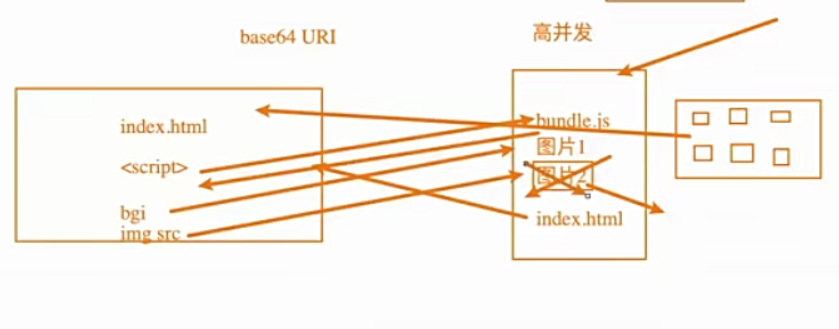

加载图片案例准备
- 为了演示我们项目可以加载图片，我们需要在项目中使用图片，比较常见的使用图片的方式是两种:
  img元素，设置src属性；
  其他元素(比如div),设置background-image的css属性；

file-loader(webpack5已经不支持使用了)
- 要处理jpg、png等格式的图片，我们也需要有对应的loader:file-loader;
  file-loader的作用就是帮助我们处理import/require()方式引入的一个文件资源，
   并且会将它放到我们输出的文件夹中；
  当然我们待会可以学习如何修改它的名字和所在文件夹；
- 安装file-loader npm install file-loader -D

文件的命名规则
- 有时候我们处理后的文件名称按照一定的规则进行显示:
  比如保留原来的文件名、拓展名，同时为了防止重复，包含一个hash值等；
- 这个时候我们可以使用PlaceHolder来完成，webpack给我们提供了大量的PlaceHolder来显示不同的内容；
  https://webpack.js.org/loaders/file-loader/#placeholders
  我们可以在文档中查阅自己需要的placeholder;
  [ext]:处理文件的拓展名;
  [name]:处理文件的名称
  [hash]:文件的内容，使用MD4的散列函数处理,生成的一个128位的hash值(32个十六进制);
  [contentHash]:在file-loader中和hash结果是一致的(在webpack的一些其他地方不一样，后面会讲到);
  [hash:<length>]:截图hash的长度,默认32个字符太长了;
  [path]:文件相对于于webpack文件的路径；

  设置文件的存放路径
  outputPath:"img"设置输出的文件夹

url-loader也是帮助我们加载资源的(webpack5都没有了)
- url-loader和file-loader的工作方式是相似的，但是可以将较小的文件，转成base64的URL。
- 图片优化:base64 URI 浏览器可以解析base64 可以不用单独发送一次请求了
        服务器高并发性能的优化

- 安装url-loader
  npm install url-loader -D
- 显示结果是一样的，并且图片可以正常显示
- 但是在dist文件夹中，我们看不到图片文件:
  这是因为我的两张图片的大小分别是38kb和295kb;
  默认情况下url-loader会将所有的图片文件转成base64编码；

url-loader的limit
- 但是开发中我们往往是小的图片需要转换，但是大的图片直接使用图片即可；
  这是因为小的图片转换base64之后可以和页面一起被请求，减少不必要的请求过程；
  而大的图片也进行转换，反而会影响页面的请求速度；
- 那么，我们如何可以限制哪些大小的图片转换和不转换呢?
  url-loader有一个options属性limit,可以用来设置转换的限制；
  下面的代码38kb的图片会进行base64编码，而295kb的不会;

认识asset module type
- 我们当前使用的webpack版本是webpack5：
  在webpack5之前，加载这些资源我们需要使用一些loader,比如raw-loader,url-loader,file-loader;
  在webpack5开始，我们可以直接使用资源模块类型(asset module type),来替代上面这些loader;
- 资源模块类型(asset module type),通过添加4种新的模块类型，来替换所有这些loader;
  asset/resource发送一个单独的文件并导出URL。之前通过使用file-loader实现；
  asset/inline导出一个资源的data URL.之前通过使用url-loader实现；
  asset/source导出资源的源代码，之前通过使用raw-loader实现；
  asset在导出一个data URL和发送一个单独的文件之间自动选择。之前通过使用url-loader,
  并且配置资源体积限制实现；
- 如何自定义文件的输出路径和文件名呢?
  1.修改output,添加assetModuleFilename属性；
  2.在Rule中，添加一个generator属性，并且设置filename;
- url-loader的limit效果
  1.将type修改为asset
  2.添加一个parser属性，并且设置dataUrl的条件，添加maxSize属性；

加载字体文件
- 如果我们需要使用某些特殊的字体或者字体图标，那么我们会引入很多字体相关的文件，
  这些文件的处理也是一样的。
- 首先，从阿里图标不中下载几个字体图标
- 在component中引入，并且添加一个i元素用于显示字体图标；

字体的打包
- 这个时候打包会报错，因为无法正确的处理eot、ttf、woff等文件；
  我们可以选择使用file-loader来处理，也可以选择直接使用webpack5的资源模块类型来处理；

认识Plugin
- Webpack的另一个核心是Plugin,官方有这样一段对Plugin的描述:
  While loaders are used to transform certain types of modules,plugns
  can be leveraged to perform a wider range of tasks like bundle optimization,
  asset management and injection of environment variables.
- 翻译过来就是
  loader是用于特定的模块类型进行转换；
  Plugin可以用于执行更加广泛的任务，比如打包优化、资源管理、环境注入等；

CleanWebpackPlugin
- 前面我们演示的过程中，每次修改了一些配置，重新打包时，都需要手动删 除dist文件夹;
  我们可以借助于一个插件来帮助我们完成，这个插件就是CleanWebpackPlugin;
  npm install clean-webpack-plugin -D
  之后再插件中配置

HtmlWebpackPlugin
- 另外还有一个不太规范的地方:
  我们的HTML文件是编写在根目录下的，而最终打包的dist文件夹中是没有index.html文件的；
  在进行项目部署时，必然也是需要有对应的入口文件index.html;
  所以我们也需要对index.html进行打包处理；
- 对HTML进行打包处理我们可以使用另外一个插件:HtmlWebpackPliugin;
  npm install html-webpack-plugin -D

- 我们会发现，现在自动在dist文件夹中，生成了一个index.html文件；
   该文件也自动添加了我们打包的bundle.js文件；
- 这个文件是如何生成的呢?
  默认情况下是根据ejs的一个模板来生成的;
  在html-webpack-plugin的源码中,有一个default_index.ejs模块;

自定义HTML模板
- 如果我们想在自己的模板中加入一些比较特别的内容:
  比如添加一个noscript标签，在用户的Javascript被关闭时，给予响应的提示;
  比如在开发vue或者react项目时，我们需要一个可以挂载后续组件的根标签
  
  

;
- 这个我们需要一个属于自己的index.html模块;

自定义模板数据填充
- 上面的代码中，会有一些类似这样的语法<%变量%>，这个是EJS模块填充数据的方式；
- 在配置HTmlWebpackPlugin时，我们需要添加如下配置:
  template:指定我们要使用的模块所在的路径；
  title:在进行htmlWebpackPlugin.options.title读取时，就会读到该信息；

DefinePliugin的介绍
- 但是，这个时候编译还是会报错，因为我们的模块中还使用到一个BASE_URL的常量；
  会报错 BASE_URL is not defined;
- 这是因为在编译template模块时，有一个BASE_URL:
   <link rel="icon" href="<%=BASE_URL%>favicon.ico">
   但是我们并没有设置过这个常量值，所以会出现没有定义的错误；
- 这个时候我们可以使用DefinePlugin插件；

DefinePlugin的使用
- DefinePlugin允许在编译时创建配置的全局常量，是一个webpack内置的插件(不需要单独安装)：
- 这个时候，编译template就可以正确的编译了，会读取到BASE_URL的值;

CopyWebpackPlugin
- 在vue的打包过程中，如果我们将一些文件放到public的目录下，那么这个目录会被复制到dist文件夹中;
  这个复制的功能，我们可以使用CopyWebpackPlugin来完成；
- 安装CopyWebpackPlugin插件:
  npm install copy-webpack-plugin -D
- 接下来配置CopyWebpackPlugin即可:
  复制的规则在patterns中配置；
  from:设置从哪一个源中开始复制；
  to:复制到的位置，可以忽略，会默认复制到打包的目录下；
  globOptions:设置一些额外的选项，其中可以编写需要忽略的文件:
     .DS_Store：mac目录下会自动生成的一二个文件；
     index.html:也不需要复制，因为我们已经通过HtmlWebpackPlugin完成了index.html的生成；

Mode配置

- 前面我们一直没有讲mode;
- Mode配置选项，可以告知webpack使用响应模式的内置优化；
     默认是production(什么都不设置的情况下)
     可选值:'none'|'development'|'production'
- 区别
     development:会将DefinePlugin中process.env.NOOE_ENV的值设置为 development,为模块和chunk启用有效的名；
     production:会将DefinePlugin中process.NOOE.ENV的值设置为   production,为模块和chunk启用确定性的混淆名。
     none 不需要任何默认优化选项；
Mode配置代表更多的东西用development来代替；(webpack要配置哪些东西不要配置哪些东西)

