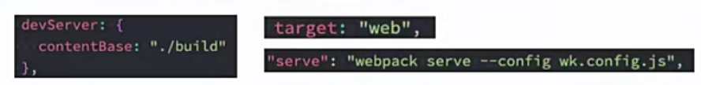
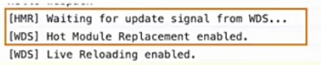
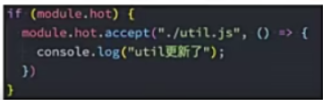
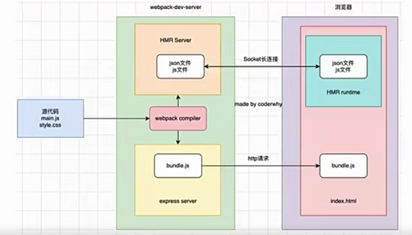
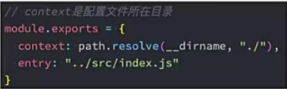

为什么要搭建本地服务器?
- 目前我们开发的代码，为了运行需要有两个操作:
  操作一:npm run build,编译相关的代码；
  操作二:通过live server或者直接通过浏览器，打开index.html代码，查看效果；
- 这个过程经常操作会影响我们的开发效率，我们希望可以做到，当文件发生变化时，可以自动的完成编译和展示；
- 为了完成自动编译,webpack提供了几种可选的方式:
  webpack watch mode;
  webpack-dev-server(常用)；
  webpack-dev-middleware;

Webpack watch
- webpack给我们提供了watch模式:
  在该模式下，webpack依赖图中的所有文件，只要有一个发生了更新，那么代码将被重新编译；
  我们不需要手动去运行npm run build指令了；
- 如何开启watch呢?两种方式:
  方式一:在导出的配置中，添加watch:true;
  方式二:在启动webpack的命令中,添加--watch的标识；
- 这里我们选择方式二,在package.json的scripts中添加一个watch的脚本；
  "watch":"webpack --watch"

webpack-dev-server
- 上面的方式可以监听到文件的变化，但是事实上它本身是没有自动刷新浏览器的功能的；
  当然，目前我们可以在VSCode中使用live-server来完成这样的功能；
  但是，我们希望在不使用live-server的情况下，可以具备live reloading(实时重新加载)的功能；
  
- 安装webpack-dev-server
  npm install webpack-dev-server -D
  
- 修改配置文件,告知dev server,从什么位置查找文件:
  
- webpack-dev-server在编译之后不会写入到任何输出文件，而是将bundle文件保留在内存中:
   事实上webpack-dev-server使用了一个库叫memfs(memory-fs webpack自己写的)

devServer:{
  contentBase:"./pulic"
}
用途:源代码直接运行.vue文件浏览器是不识别的，所以源代码要经过打包，通过devServer进行打包，打包后将所有的静态资源放到内存里面memfs，之后会开启一个express的服务器，浏览器就会访问这个服务器的(通过localhost:8080访问)，访问的时候服务器就会将我访问的资源下载下来，但是本质上访问服务器下载下来的是index.html,
我们的index.html里还有其他的资源(link img script)，会从express里面把这些资源加载下来，
比如script标签引用资源abc.js,向我们服务器要我们打包的abc.js,
但是我们打包的bundle.js里面没有abc.js,
正常找不到这个资源浏览器会报错，
但是我们依然希望abc.js是有效的，
这个时候可以通过devServer配置一个contentBase对应一个文件夹，
让express去这个文件夹里去读，读到express内存里面，再通过express返回给它，这时就能加载这个资源了。

此外我们去加载favicon.ico这个资源时，用到copyWebpackPlugin插件帮助我们
把public文件夹里面东西复制到bundle.js里面，所以原来我们去加载这个资源时可以正常加载的。删掉这个插件就不会在复制了，就意味着我在去加载这个资源时打包里就没有了，
所以加载不到contentBase:public去public文件夹里面请求。

开发阶段 不想用copyWebpackPlugin做拷贝会对打包编译损耗性能,设置contentBase
打包(生产)阶段:用copyWebpackPlugin,部署时要打包的是bundle.js，所以还需要对文件夹东西做一个拷贝的。

认识模块热替换(HMR)
- 什么是HMR呢?
  HMR的全称是Hot Module Replacement，翻译为模块热替换；
  模块热替换是指在应用过程中，替换、添加、删除模块，而无需重新刷新整个页面;

浏览器刷新不是一个好的现象，有时候不希望浏览器随便做刷新的。
(浏览器刷新原来保留的状态count会重置，所有状态都不存在了，不太好...,清除状态了)
(性能，应用程序非常大，只改一小块要重新加载所有部分，改一个文件只加载修改一个文件)

- HMR通过如下几种方式，来提高开发的速度:
  不重新加载整个页面，这样可以保留某些应用程序的状态不丢失；
  只更新需要变化的内容，节省开发的时间；
  修改了css、js源代码，会立即在浏览器更新，相当于直接在浏览器的devtools中直接修改样式；
- 如何使用HMR呢?
  默认情况下，webpack-dev-server已经支持HMR，我们只需开启即可；
  在不开启HMR的情况下，当我们修改了源代码之后，整个页面会自动刷新，使用的是live reloading;

开启HMR
- 修改webpack的配置：
  devServer:{hot:true}
- 效果：
- 
- 但是你会发现，当我们修改了某一个模块的代码时，依然是刷新的整个页面:
   这是因为我们需要去指定哪些模块发生更新时，进行HMR；
   

框架的HMR
- 有一个问题:在开发其他项目时，我们是否需要经常手动去写入module.hot.accept相关的API呢?
  比如开发Vue、React项目，我们修改了组件，希望进行热更新，这个时候应该如何去操作呢?
  事实上社区已经针对这些有很成熟的方案了；
  比如Vue开发中，我们使用vue-loader,此loader支持vue组件的HMR，提供开箱即用的体验；
  比如react开发中，有React Hot Loader,实时调整react组件(目前React官方已经弃用了，改用raect-refresh);

HMR的原理
- 那么HMR的原理是什么呢?如何可以做到只更新一个模块中的内容呢?
  webpack-dev-server会创建两个服务:提供静态资源的服务(express)和Socket服务(net.Socket);
  express server负责直接提供静态资源的服务(打包后的资源直接被浏览器请求和解析)；
  
- HMR Socket Server,是一个socket的长连接：
  长连接有一个最好的好处是建立连接后双方可以通信(服务器可以直接发送文件到客户端)；
  当服务器监听到对应的模块发生变化时，会生成两个文件.json(manifest文件)和.js文件(update chunk);
  通过长连接，可以直接将这两个文件主动发送给客户端(浏览器)；
  浏览器拿到两个新的文件后，通过HMR runtime机制,加载这两个文件，并且针对修改的模块进行更新；
  
  
  没有开启HMR时：
  源代码经过webpack的编译，编译完后打包出对应的资源bundle.js,
  这个时候webpack devServer就会开启一个express server静态服务器,
  之后浏览器去发送http请求的时候,会做http的响应，响应下来后就请求下来对应的资源了；
  然后我在执行对应的bundle.js,最后在浏览器里展示最后的一个效果。
  一旦开启HMR：
  会另外在开启一个服务，称之为HMR Server模块热替换的服务,这个服务的本质是一个Socket Server;Socket一般是建立长连接的(http服务器建立是http连接短连接)，
  短连接客户端发送http请求->和服务器建立连接->服务器做出响应->断开连接(服务器一般承受连接数是有限的，同一时刻有很多连接，服务器压力会太大了)
  Socket长连接一般用于即时通讯，微信发消息，直播聊天，直播间送礼物，进场消息
  长连接经历连接后双方建立了一个通道，这个通道是一直保持的(通过心跳包判断客户端是否存在)，短连接是客户端必须发送请求服务端才做出响应，基本很少出现服务器把某个消息
  主动给客户端的，长连接可以实时双方在通道上任意通信，即时通信。
  假如说源代码某个文件发生改变了，那么我只想更新这一个文件的时候，
  webpack会监听源代码里面所有的文件，哪一个文件发生了改变了，一旦发生了改变会立马对这个文件再做一次编译，进行编译一种办法是直接告诉浏览器全部做一个刷新，一旦进行刷新所有资源都请求一次(刷新浏览器很多弊端不采用)，另一种办法就是我只有这一个文件发生了改变，我只需要更新这一个文件就可以了，那么它就会根据这一个文件的变化做一个编译
  来到HRM Server生成两个文件.json文件描述文件(描述哪一部分发生变化了)，js文件(具体变化的内容，变化之后的js文件)
  那么在HMR Server里会多出这两个文件，服务器主动的把这两个文件传递给客户端，
  传过去之后客户端有一个叫HMR runtime机制，它会监听服务器传过来的这两个文件，
  根据这两个文件决定浏览器哪一部分需要更新，热更新

hotOnly、host配置
- host设置主机地址:
  默认值时localhost;
  如果希望其他地方也可以访问,可以设置为0.0.0.0；
- localhost和0.0.0.0的区别:
  localhost:本质上一个域名，通常情况下会被解析成127.0.0.1；
  127.0.0.1：回环地址(Loop Back Address),表达的意思其实是我们主机自己发出去的包，
  知己被自己接受；
    正常的数据库包经常 应用层-传输层-网络层-数据链路层-物理层；
    而回环地址，是在网络层直接就被获取到了，是不会经常数据链路层和物理层的;
    比如我们监听127.0.0.1时，在同一个网段下的主机中，通过ip地址是不能访问的;
  0.0.0.0：监听IPV4上所有的地址，再根据端口找到不同的应用程序；
    比如我们监听0.0.0.0时，在同一个网段下的主机中，通过ip地址是可以访问的。

port、open、compress
- port设置监听的端口，默认情况下是8080
- open是否打开浏览器:
   默认值是false,设置为true会打开浏览器
   也可以设置为类似于Google Chrome等值
- compress是否为静态文件开启gzip compression:(服务端把静态资源下载下来太大了，gzip压缩bundle.js)
  默认值是false,可以设置为true;

Proxy
- proxy是我们开发中非常常用的一个配置选项，它的目的设置代理来解决跨域访问的问题:
   比如我们的一个api请求是http://localhost:8888,但是本地启用服务器的域名是
   http://localhost:8000,这个时候发送网络请求就会出现跨域的问题；
   那么我们可以将请求先发送到一个代理服务器，代理服务器和API服务器没有跨域的问题，就可以解决我们的跨域问题了。
- 我们可以进行如下的设置:
  target:表示的是代理到的目标地址，比如/api-hy/moment会被代理到http://localhost:8888/api-hy/moment;
  pathRewrite:默认情况下，我们的/api-hy也会被写入到URL中，如果希望删除，可以使用pathRewrite;
  secure:默认情况下不接收转发到https的服务器上，如果希望支持，可以设置为false;
  changeOrigin:它表示是否更新代理后请求的headers中的host地址；

changeOrigin的解析
- 这个changeOrigin官方说的非常模糊，通过查看源码我发现其实是要修改代理请求中的headers中的host属性:
   因为我们真实的请求,其实是需要通过http://localhost:8888来请求的；
   但是因为使用了代码，默认情况下它的值是http://localhost:8000;
   如果我们需要修改，那么可以将changeOrigin设置为true即可。

historyApiFallback
- historyApiFallback是开发中一个非常常见的属性，它主要的作用是解决SPA页面在路由跳转之后，进行页面刷新时，返回404的错误。
- boolean值:默然是false
   如果是设置为true,那么在刷新时，返回404错误时，会自动返回index.html的内容；
- object类型的值，可以配置rewrites属性(了解):
   可以设置from来匹配路径，决定要跳转到哪一个页面；
- 事实上devServer中实现historyApiFallback功能是通过connect-history-api-fallback库的:
   可以查看connect-history-api-fallback文档

resolve模块解析
- resolve用于设置模块如何被解析:
   在开发中我们会有各种各样的模块依赖，这些模块可能来自于自己编写的代码，也可能来自第三方库；
   resolve可以帮助webpack从每个require/import语句中，找到需要引入到合适的模块代码；
   webpack使用enhanced-resolve来解析文件路径；
- webpack能解析三种文件路径:
- 绝对路径
    由于已经获得文件的绝对路径，因此不需要再做进一步解析。
- 相对路径
    在这种情况下，使用import或require的资源文件所处的目录，被认为是上下文目录；
    在import/require中给定的相对路径，会拼接此上下文路径，来生成模块的绝对路径；
- 模块路径
    在resolve.modules中指定的所有目录检索模块；
       默认值是['node_modules'],所以默认会从node_modules中查找文件；
    我们可以通过设置别名的方式来替换初始模块路径，具体后面讲解alias的配置；

确定文件还是文件夹
- 如果是一个文件:
   如果文件具有拓展名，则直接打包文件；
   否则，将使用resolve.extensions选项作为文件拓展名解析；
- 如果是一个文件夹
   会在文件夹中根据resolve.mainFiles配置选项中指定的文件顺序查找:
      resolve.mainFiles的默认值是['index'];
      再根据resolve.extensions来解析拓展名；

extensions和alias配置
- extensions是解析到文件时自动添加拓展名:
   默认值是['.wasm','.mjs','.js','.json'];
   所以如果我们代码中想要添加加载.vue或者jsx或者ts等文件时，我们必须自己写上拓展名;
- 另一个非常好用的功能是配置别名alias:
   特别是当我们项目的目录结构比较深的时候，或者一个文件的路径可能需要../../../这种路径片段;
   我们可以给某些常见的路径起一个别名;

如何区分开发环境
- 目前我们所有的webpack配置信息都是放到一个配置文件中的:webpack.config.js
   当配置越来越多时，这个文件会变得越来越不容易维护；
   并且某些配置是在开发环境需要使用的，某些配置是在生成环境需要使用的，
   当然某些配置是在开发和生成环境都会使用的；
   所以，我们最好对配置进行划分，方便我们维护和管理；
- 那么，在启动时如何区分不同的配置呢?
   1.编写两个不同的配置文件，开发和生成时，分别加载不同的配置文件即可；
   2.使用相同的一个入口配置文件，通过设置参数来区分它们；

入口文件解析
- 我们之前编写入口文件的规则是这样的:'./src/index,js',但是如果我们的配置文件所在的位置变成了config目录，
  我们是否应该变成../src/index.js呢？
    如果我们这样编写，会发现是错误的，依然要写成./src/index.js;
    这是因为入口文件其实是和另一个属性是有关的context;
  
- context的作用是用于解析入口(entrt point)和加载器(loader):
   官方说法:默认是当前路径(但是经过我测试，默认应该是webpack的启动目录)
   另外推荐在配置中传入一个值；
   
   

